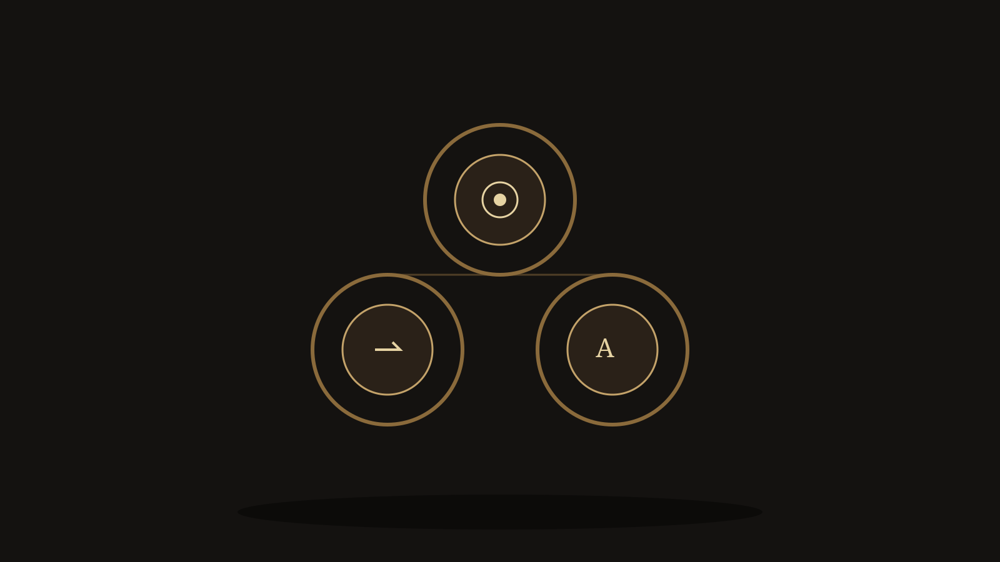

# Semion

<p align="center">
  
</p>

**Triad specialist** for the Abraxas model stack. Corpus atoms in. `semion.frame.v0` out.

Named for Greek *sēmeion*: a sign. Semiosis is the chain. This repo is the classifier, not the mind.

[](https://github.com/scrimshawlife-ctrl/Semion/actions/workflows/validate.yml)

| | |
|---|---|
| **Owns** | triad · sign class · corpus adapt |
| **Honesty** | `OBSERVED` / `INFERRED` / `SPECULATIVE` / `NOT_COMPUTABLE` |
| **Shape** | T0 rules now. Encoder name-gated. Not a chatbot. |
| **Anti** | phenomenal heads · forecast mint · numeric Brier · chat trunk · Hyperlex form route · Athanor family gold |
| **Lane** | SHADOW — classify live · train/Hub gated |

The Validate badge may stay red when Actions billing blocks the workflow even if local `pytest` passes.

## Social preview

GitHub / link-preview card: [`assets/og-social.svg`](assets/og-social.svg) (1280×640). Distinct from the README hero.
Raster stills for Settings → Social preview live at `assets/og-social.jpg` once dropped (see `assets/README.md`).

## Quick links

| Doc | Path |
|-----|------|
| Status | [`STATUS.md`](STATUS.md) |
| Constitution | [`.specify/memory/constitution.md`](.specify/memory/constitution.md) |
| Spec 000 spine | [`specs/000-semion-spine/spec.md`](specs/000-semion-spine/spec.md) |
| Spec 001 triad | [`specs/001-semion-triad/spec.md`](specs/001-semion-triad/spec.md) |
| Model card | [`MODEL_CARD.md`](MODEL_CARD.md) |
| Quickstart | [`docs/quickstart.md`](docs/quickstart.md) |
| Dual-use | [`docs/dual-use.md`](docs/dual-use.md) |
| Architecture | [`ARCHITECTURE.md`](ARCHITECTURE.md) |

## Install and classify

```bash
pip install -e ".[dev]"
python -m semion --version
python -m semion classify '{"sign_form":"smoke column","object_candidate":"fire","classification":"index"}'
pytest -q
```

Local labeled corpus, when it exists, lives at `~/.semion/corpus/atoms.jsonl` — **not in git**.

## Peers

Hyperlex (form / lexical) · Athanor (tradition structure) · **Semion (sign relation)** · abx.brier (settled calibration)

## License

Code: MIT. Corpus atoms carry their own licenses — see `LICENSE_POLICY.md`.
