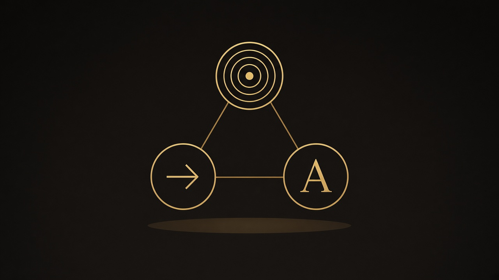

# Semion

<p align="center">
  
</p>

**Triad specialist** for the Abraxas model stack. Corpus atoms in. `semion.frame.v0` out.

Named for Greek *sēmeion*: a sign. Semiosis is the chain. This repo is the classifier, not the mind.

[](https://github.com/scrimshawlife-ctrl/Semion/actions/workflows/validate.yml)

| | |
|---|---|
| **Owns** | triad · sign class · corpus adapt · semiosis export |
| **Honesty** | `OBSERVED` / `INFERRED` / `SPECULATIVE` / `NOT_COMPUTABLE` |
| **Shape** | Spec 001–003 **T0 live**. Spec 004 encoder **name-gated**. Not a chatbot. |
| **Anti** | phenomenal heads · forecast mint · numeric Brier · chat trunk · Hyperlex form route · Athanor family gold |
| **Lane** | SHADOW — classify live · train/Hub gated |
| **Version** | `0.1.0` (see [`STATUS.md`](STATUS.md)) |

The Validate badge may stay red when Actions billing blocks the workflow even if local `pytest` passes. Local tests are the bar.

## What ships / what does not

| Ships now | Does **not** ship |
|-----------|-------------------|
| T0 `classify` / `adapt` / chain export (`compat`) | Trained encoder weights / Hub upload |
| Spec 004 encoder **gate** (name_gate **false**) | `ALLOW_TRAIN` / `ALLOW_HUB` from Boof |
| M2 rebalance gold floors **PASS** (local SoT + Aaron pack) | Full labeled SoT in git |
| Hero + OG rasters | Auto Settings social-preview write |

## Current state (OBSERVED 2026-09-11 PT)

| Area | State |
|------|-------|
| Spec 000–003 | Specified + code |
| Spec 004 encoder gate | Specified · `name_gate` **false** · dataset note landed |
| Local gold SoT | `~/.semion/corpus/dataset.jsonl` — **482** gold (**not in git**) |
| OBSERVED share | **14 / 482** (~3%) — wrap/seed lawful INFERRED; AMC/Foundations preferred |
| Hunt plan | [`docs/amc-foundations-hunt-plan.md`](docs/amc-foundations-hunt-plan.md) |
| Splits | train **330** · val **50** · test **102** |
| keep_weak | **150** (demoted wrap-symbol; **not** gold) |
| Spec 004 class floors | **PASS** (icon/index/symbol ≥15%; mixed/NC ≥8%) |
| Hub / HF | **Skipped** (Danny) |
| Boof `ALLOW_TRAIN` | **false** — Aaron trains on Spark |
| Aaron Notion pack | https://app.notion.com/p/3d83e8ba2f5c81608499deffc060160d |
| Handoff | [`docs/aaron-train-handoff.md`](docs/aaron-train-handoff.md) |

## Social preview

Raster card: [`assets/og-social.jpg`](assets/og-social.jpg) (1280×640) · also [`assets/og-social.png`](assets/og-social.png).
SVG stand-in: [`assets/og-social.svg`](assets/og-social.svg).
Settings → Social preview is **manual** (no API/MCP). Private repos may block first custom OG.

## Pipeline

```
source packet → adapt() → atom → classify() → semion.frame.v0
                                              ↓
                                    frame_to_semiosis()
                                              ↓
                         SemiosisFrame-shaped dict (export only)
```

Router home: `yggdrasil.belief`. Mixed slang+sign → Hyperlex first. Mixed tradition+sign → Athanor first.
No circular import of Abraxas. See [`ARCHITECTURE.md`](ARCHITECTURE.md).

## Specs

| Spec | Role | Path |
|------|------|------|
| 000 spine | Constitution / dual-use | [`specs/000-semion-spine/`](specs/000-semion-spine/) |
| 001 triad | T0 classify | [`specs/001-semion-triad/`](specs/001-semion-triad/) |
| 002 corpus adapt | Adapt packets → atoms | [`specs/002-corpus-adapt/`](specs/002-corpus-adapt/) |
| 003 chain | Semiosis export | [`specs/003-semiosis-chain/`](specs/003-semiosis-chain/) |
| 004 encoder gate | Name-gate + floors | [`specs/004-encoder-gate/`](specs/004-encoder-gate/) |

## Quick links

| Doc | Path |
|-----|------|
| Status | [`STATUS.md`](STATUS.md) |
| Aaron train handoff | [`docs/aaron-train-handoff.md`](docs/aaron-train-handoff.md) |
| Milestones | [`specs/MILESTONES.md`](specs/MILESTONES.md) |
| Constitution | [`.specify/memory/constitution.md`](.specify/memory/constitution.md) |
| Model card | [`MODEL_CARD.md`](MODEL_CARD.md) |
| Quickstart | [`docs/quickstart.md`](docs/quickstart.md) |
| Architecture | [`ARCHITECTURE.md`](ARCHITECTURE.md) |
| Dual-use | [`specs/000-semion-spine/dual-use-gate.md`](specs/000-semion-spine/dual-use-gate.md) |

## Install and classify

```bash
pip install -e ".[dev]"
python -m semion --version
python -m semion classify '{"sign_form":"smoke column","object_candidate":"fire","classification":"index"}'
pytest -q
```

Expected: `sign_class=index`, `phenomenal=false`, `forecast_eligible=false`.

Local labeled corpus lives at `~/.semion/corpus/dataset.jsonl` (plus `keep_weak.jsonl`) — **not in git**.

## Corpus and train packs

| Layer | Where | In git? |
|-------|-------|---------|
| Gold SoT | `~/.semion/corpus/dataset.jsonl` | **No** |
| keep_weak | `~/.semion/corpus/keep_weak.jsonl` | **No** |
| Aaron zip / Notion | operator Notion page (see handoff) | **No** (Hub skipped) |

Gold pool note: OBSERVED + INFERRED wrap/seed labels. Keep `keep_weak` **out** of gold unless an explicit weak-lane flag is set.
Dual-use / `NOT_COMPUTABLE` rows are refuse probes.

## Fail-closed gates

Do **not** without Danny/operator yes:

- Commit SoT / gold dumps into git
- Flip `name_gate` or publish to Hugging Face (`ALLOW_HUB`)
- Treat Notion/email delivery as a green name-gate
- Mix `keep_weak` into gold without a weak-lane flag
- Forecast mint, phenomenal heads, or numeric Brier in this package

## Peers

Hyperlex (form / lexical) · Athanor (tradition structure) · **Semion (sign relation)** · Yggdrasil (route classifier) · abx.brier (settled calibration)

## License

Code: MIT. Corpus atoms carry their own licenses — see [`LICENSE_POLICY.md`](LICENSE_POLICY.md).
